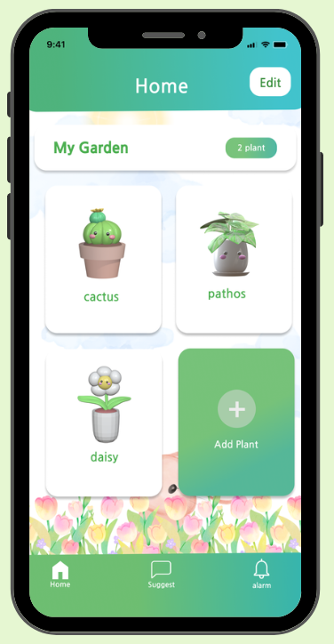

# GreenBuddy 🌱

A Flutter-based plant care management application that helps users monitor and track the growth of their plants efficiently.

## Table of Contents

- [Features](#features)
- [Screenshots](#screenshots)
- [Demo Video](#demo-video)
- [Tech Stack](#tech-stack)
- [Getting Started](#getting-started)
  - [Prerequisites](#prerequisites)
  - [Installation](#installation)
  - [Running the App](#running-the-app)
- [Usage Guide](#usage-guide)
- [Project Structure](#project-structure)
- [Supported Plants](#supported-plants)
- [Contributing](#contributing)
- [License](#license)
- [Developer](#developer)

## Features

- **Plant Management**: Add, edit, and remove plants from your collection
- **Real-time Monitoring**: Track soil moisture, temperature, and humidity levels
- **Multiple Plant Types**: Support for various plant species including Daisy, Rose, Orchid, Holy Basil, and more
- **Smart Care Recommendations**: Get personalized care tips based on plant type and sensor data
- **User-friendly Interface**: Clean, intuitive design with visual indicators
- **Multilingual Support**: Available in both Thai and English
- **Data Persistence**: Local database storage using Sembast NoSQL

## Screenshots



## Demo Video

Watch GreenBuddy in action:

[](https://youtu.be/oHkVxUplFMk?si=WueRoZ4eajSMAW_0)

[Watch on YouTube](https://youtu.be/oHkVxUplFMk?si=WueRoZ4eajSMAW_0)

## Tech Stack

- **Framework**: Flutter
- **Database**: Sembast NoSQL
- **State Management**: Provider
- **UI Design**: Material Design
- **Fonts**: Google Fonts (Kanit)

## Getting Started

### Prerequisites

Before you begin, ensure you have the following installed:

- Flutter SDK (3.0 or higher recommended)
- Dart SDK
- Android Studio / Xcode (for mobile development)
- Git

### Installation

1. **Install Flutter SDK**

   Download and install Flutter from [flutter.dev](https://flutter.dev/docs/get-started/install)

   Verify installation:
   ```bash
   flutter doctor
   ```

2. **Clone the repository**
   ```bash
   git clone https://github.com/ParichatrSaipan/GreenBuddy.git
   cd GreenBuddy
   ```

3. **Install dependencies**
   ```bash
   flutter pub get
   ```

### Running the App

Run the application on your preferred device/emulator:

```bash
flutter run
```

For specific platforms:
```bash
# Android
flutter run -d android

# iOS
flutter run -d ios

# Web
flutter run -d chrome
```

## Usage Guide

### Adding a New Plant

1. Open GreenBuddy
2. Tap the **"+"** button on the home screen
3. Select your plant type from the available options
4. Enter a custom name for your plant
5. Choose a color identifier
6. Save your plant

### Monitoring Plant Health

1. Tap on any plant card from your collection
2. View real-time sensor data:
   - **Soil Moisture**: 0-100%
   - **Temperature**: Current ambient temperature
   - **Humidity**: Air humidity percentage
3. Follow the care recommendations displayed

### Managing Your Plants

- **Edit Mode**: Toggle edit mode to select and manage multiple plants
- **Delete Plants**: Select plants in edit mode and confirm deletion
- **Update Information**: Tap on a plant to view and update its details

### Best Practices

- Check soil moisture regularly before watering
- Adjust watering schedule based on sensor readings
- Review plant-specific care tips in the recommendations section
- Monitor temperature and humidity to ensure optimal growing conditions

## Project Structure

```
GreenBuddy/
├── lib/
│   ├── main.dart              # Application entry point
│   ├── database/              # Database management
│   ├── provider/              # State management providers
│   ├── screen/                # UI screens
│   └── structure/             # Data models and shared widgets
├── assets/                    # Images and resources
├── pubspec.yaml               # Project dependencies
└── README.md                  # This file
```

## Supported Plants

GreenBuddy currently supports the following plant types:

- Daisy
- Rose
- Orchid
- Holy Basil (Thai Basil)
- Anthurium
- And more...

Each plant type comes with specific care guidelines and optimal environmental parameters.

